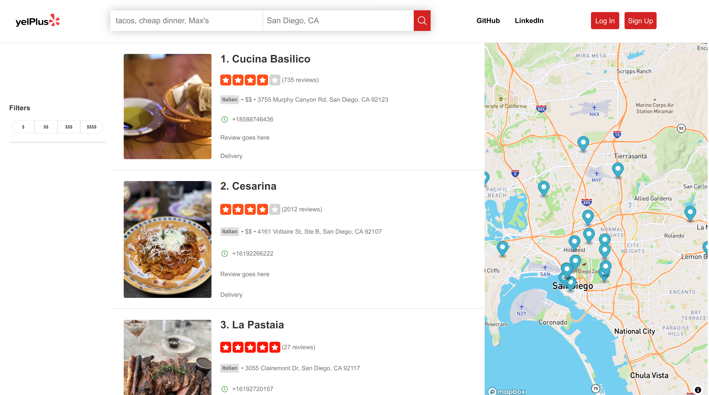

# README

### Live link: https://yelplus.onrender.com/

## Background

YelPlus is a full stack clone of Yelp; it allows for a user to search for and view restaurants with full CRUD functionality.

YelPlus was developed using Ruby on Rails and PostgreSQL for its backend, and JavaScript, React, and Redux for its frontend.

## Functionality, Features, MVPs

YelPlus has seven core features:

1. User Authentication & Demo User Account
   - User can create their own account or Login as a Demo User

2. Business Search

   - Users can search for businesses based on their query and location.
   - Users can view detailed information about a specific business including reviews, ratings, photos, and more.

3. Mapbox Maps and restaurant location pins
   - Utilizes Mapbox Maps API
   - Renders restaurant seed locations based on restaurant latitude and longitude
4. Search bar and filtering
   - User can search and filter by restaurant name, cuisine, or price
5. Restaurant Index page / Restaurant Show page

6. Hosting on Render.com

   - https://yelplus.onrender.com/

7. Production ReadME

## Future Features

- Set up AWS
  - This will allow for:
    - Upload review images
    - Create dummy business that exist locally on YelPlus
- User Profile
  - Will allow users to:
    - Update personal information
    - Access all user's reviews in one place
- Reviews
  - Will allow users to read and interact with reviews

## Technologies, Libraries, APIs

- Database: PostgreSQL
- Backend: Ruby on Rails
- Frontend: JavaScript, React, Redux, JSX, DOM Manipulation Vanilla JS, React Icons, Icons 8, Font Awesome
- APIs: Yelp Fusion API for business data, Mapbox API for map data
